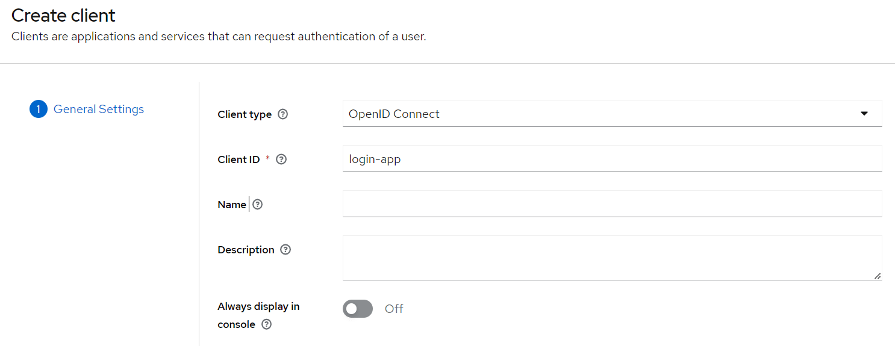

# Example of Spring Boot REST API secured with keycloak

## Introduction

This is an example of a Spring Boot REST API secured with keycloak. KeyCloak is an open source identity and access
management solution. It makes it easy to secure applications and services with little to no code.

Springboot is a framework that allows you to create stand-alone, production-grade Spring based Applications that you
can "just run".

The combination of both allows you to create a micro system environment with a REST API secured with keycloak as a
single sign on solution.

Due to deprecation of the keycloak-spring-boot-adapter, this example tries to circumvent the problem by using the
spring-addons-starter-oidc library implemented by the Spring Addons project.

## Getting Started

1. Clone the repository.
2. Navigate to the project directory.
3. Run `./gradlew build` to build the project.
4. Run `./gradlew run` to run the project.
5.

## Prerequisites

To run this project you'll need a running instance of keycloak. You can download it from the official website.

### Download Keycloak

There are several distributions to choose from. However, in this tutorial, we’ll be using the standalone version.

Let’s download the [Keycloak-22.0.3 Standalone server](https://www.keycloak.org/archive/downloads-22.0.3.html)
distribution from the official source.

### Start Keycloak

Once we’ve downloaded the Standalone server distribution, we can unzip and start Keycloak from the terminal:

```bash
$ unzip keycloak-22.0.3.zip
$ cd keycloak-22.0.3
$ bin/kc.sh start-dev
```

After running these commands, Keycloak will be starting its services. Once we see a line containing Keycloak 22.0.3 […]
started, we’ll know its start-up is complete.

Now let’s open a browser and visit http://localhost:8080. We’ll be redirected to http://localhost:8080/auth to create an
administrative login:


### Create an Administrative User

Let’s create an initial admin user named initial1 with the password zaq1!QAZ. Upon clicking Create, we’ll see the
message User Created.


We can now proceed to the Administrative Console. On the login page, we’ll enter the initial admin user credentials:

### Creating a realm

A successful login will take us to the console and open up the default Master realm for us.

Here we’ll focus on creating a custom realm.

Let’s navigate to the upper left corner to discover the Create realm button:


On the next screen, let’s add a new realm called SpringBootKeycloak:


After clicking the Create button, a new realm will be created and we’ll be redirected to it. All the operations in the
next sections will be performed in this new SpringBootKeycloak realm.

### Create a Client

Now we’ll navigate to the Clients page. As we can see in the image below, Keycloak comes with Clients that are already
built-in:


We still need to add a new client to our application, so we’ll click Create. We’ll call the new Client login-app:



In the next screen, for the purpose of this tutorial, we’ll leave all the defaults.

### Creating a Role and a User

Keycloak uses Role-Based Access; therefore, each user must have a role. To do that, we need to navigate to the Realm
Roles page:


Create two roles:

- profiles1
- profiles2

#### Create a user

Now we have a role that can be assigned to users, but as there are no users yet, let’s go to the Users page and add one.
Navigate to the Users page and click Add user:


We’ll add a user named user1:


Once the user is created, a page with its details will be displayed:


We can now go to the Credentials tab. We’ll be setting the initial password to user1pwd. We’ll also disable the
Temporary option!


Finally, we’ll navigate to the Role Mappings tab. We’ll be assigning the profile1 role to our user1.

#### Create a 2nd user

Replicate the previous steps to create a 2nd user named user2 with the password user2pwd and assign the profile2 role to
it.

### Generating Access Tokens With Keycloak’s API

Keycloak provides a REST API for generating and refreshing access tokens. We can easily use this API to create our own
login page.

First, we need to acquire an access token from Keycloak by sending a POST request to this URL:

```text
http://localhost:8080/realms/SpringBootKeycloak/protocol/openid-connect/token
```

The request should have this body in a x-www-form-urlencoded format:

```text
client_id:<your_client_id>
username:<your_username>
password:<your_password>
grant_type:password
```

Keycloak will respond to this with a new access_token and refresh_token.

## Configure out Spring Boot Application as OAuth2 Resource Server with spring-addons-starter-oidc

App exposes a REST API secured with access tokens. It is consumed by an OAuth2 REST client. A few sample of such
clients:

- another Spring application configured as an OAuth2 client and using WebClient, @FeignClient, RestTemplate or alike
- development tools like Postman capable of fetching OAuth2 tokens and issuing REST requests
- Javascript based application configured as a "public" OAuth2 client with a library like angular-auth-oidc-client

### Add the spring-addons-starter-oidc dependency

If you are using Maven, add the following dependencies to your pom.xml:

```xml
<dependencies>
    
    ...
    
    <dependency>
        <groupId>org.springframework.boot</groupId>
        <artifactId>spring-boot-starter-oauth2-resource-server</artifactId>
    </dependency>
    <dependency>
    <groupId>com.c4-soft.springaddons</groupId>
    <artifactId>spring-addons-starter-oidc</artifactId>
    <version>7.1.3</version>
    </dependency>
    
</dependencies>
```

If you are using Gradle, add the following dependency to your build.gradle:

```groovy
implementation 'org.springframework.boot:spring-boot-starter-oauth2-resource-server'
implementation 'com.c4-soft.springaddons:spring-addons-starter-oidc:7.1.3'
``` 

### Configure the application.yml

Remember that out keycloak instance is running on http://localhost:8080. We need to configure out app to run on a
different port, for example 8081.

The issuer url is http://localhost:8080/realms/SpringBootKeycloak (remember the name of the realm we created in the
keycloak admin console).

The username-claim is the name of the claim that contains the username. In our case it is preferred_username. 

The authorities are the claims that contain the roles. In our case we have two claims: realm_access.roles and
resource_access.*.roles. The first one contains the roles that are assigned to the user in the realm. The second one
contains the roles that are assigned to the user in the client.

The resourceserver.permit-all is a list of paths that are not secured. In our case we have only one path that is
/greet/public.

The resourceserver.cors is a list of paths that are allowed to be accessed from a different origin. In our case we have
only one path that is /**. The allowed-origin-patterns is set to * to allow all origins. The allowed-methods is set to *
to allow all methods.

This is just a way to simplify our example. In a real world scenario you should configure the cors to allow only the
origins and methods that you need.

```yaml
server:
  port: 8081

com:
  c4-soft:
    springaddons:
      oidc:
        ops:
          - iss: http://localhost:8080/realms/SpringBootKeycloak
            username-claim: preferred_username
            authorities:
              - path: $.realm_access.roles
              - path: $.resource_access.*.roles
        resourceserver:
          permit-all:
            - "/greet/public"
          cors:
            - path: /**
              allowed-origin-patterns: '*'
              allowed-methods: '*'
```

## License

This project is licensed under the MIT License - see the [LICENSE.md](LICENSE.md) file for details